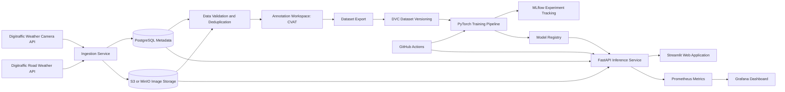
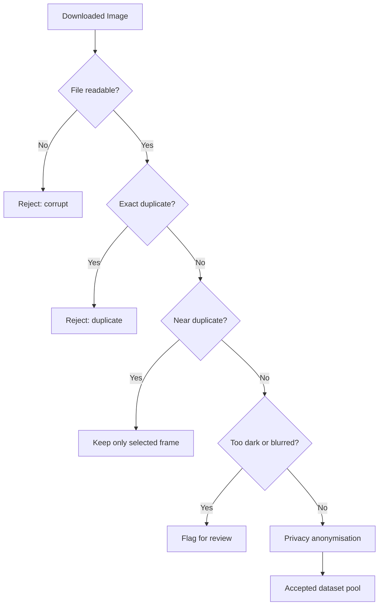
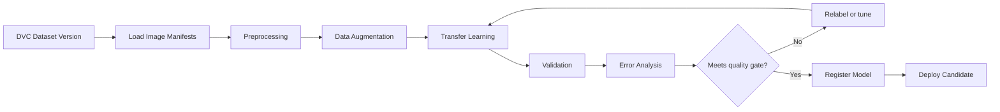
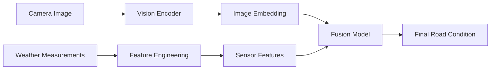
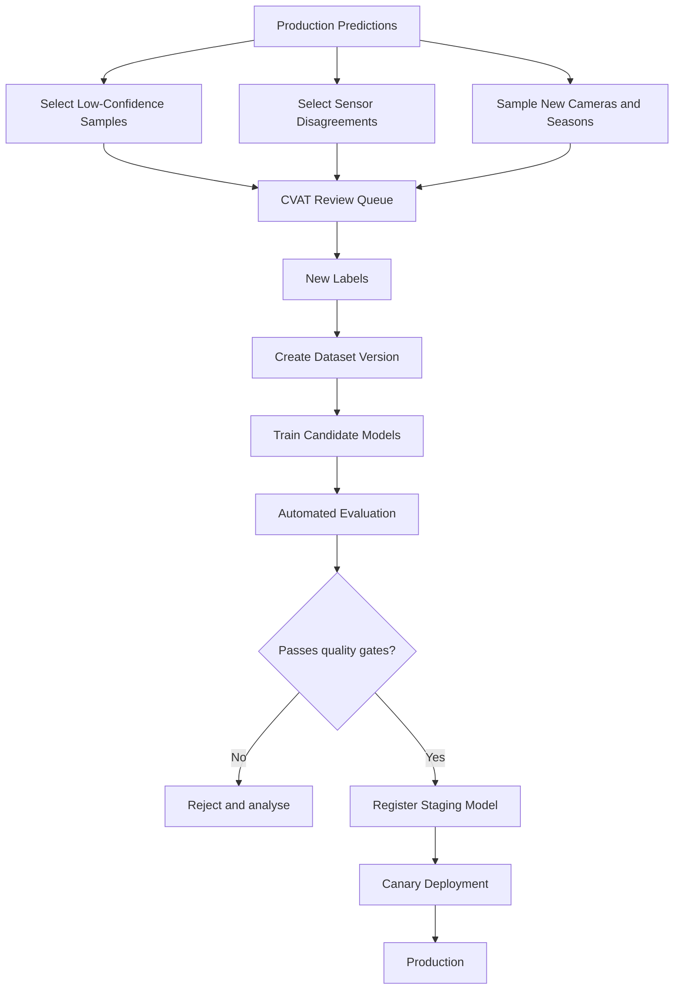

# Finnish Road Condition Intelligence Platform

## Architecture and AI Engineering Pipeline

**Project type:** End-to-end computer vision, sensor-fusion, data engineering, MLOps, and web application  
**Primary data source:** Fintraffic Digitraffic open road-traffic APIs  
**Initial prediction task:** Classify road-camera images as `dry`, `wet`, `snowy`, or `uncertain`  
**Target users:** Drivers, researchers, transport operators, and AI engineering recruiters evaluating the project

---

## 1. Project Summary

The Finnish Road Condition Intelligence Platform collects road-camera images and nearby road-weather measurements from Finland's Digitraffic service. It builds a versioned image dataset, supports human-assisted annotation, trains a computer-vision model, combines visual predictions with weather-sensor information, and serves the result through a web application and REST API.

A user selects a road camera on a map and receives:

- the latest road-camera image;
- the predicted road-surface condition;
- model confidence;
- nearby weather measurements;
- a simple driving-risk estimate;
- a warning when the image model and sensor data disagree.

Example output:

```text
Road condition: Snow-covered
Confidence: 91%
Visibility: Moderate
Road temperature: -5.8 °C
Air temperature: -7.1 °C
Precipitation: Snow
Risk level: High
```

The project is intentionally broader than a single model-training notebook. It demonstrates the complete AI engineering lifecycle: ingestion, storage, validation, annotation, dataset versioning, training, experiment tracking, deployment, monitoring, and retraining.

---

## 2. Why This Project Matters

This project solves a genuinely Finnish problem rather than asking another neural network to distinguish cats from dogs, a burden computer vision has carried long enough.

It is useful because:

- Finland has changing road conditions across seasons and regions.
- Road-surface conditions are relevant to transport safety.
- Digitraffic provides open camera and weather data.
- The raw camera images are not labelled for the proposed AI classes.
- Camera images and physical sensor readings enable multimodal or sensor-fusion experiments.
- The system can be expanded into edge AI, anomaly detection, forecasting, and geographic analytics.

For a portfolio, it demonstrates competence in several areas commonly expected from AI engineers:

- Python application development
- API integration
- computer vision
- data pipelines
- PostgreSQL and object storage
- PyTorch
- experiment tracking
- model serving
- Docker
- CI/CD
- monitoring
- cloud or Kubernetes deployment

---

## 3. Product Scope

### 3.1 MVP scope

The first version should:

1. Collect images from 5 to 10 road cameras.
2. Collect nearby weather-station measurements.
3. Store images and metadata.
4. Remove duplicate and unusable images.
5. Label a subset into four classes:
   - `dry`
   - `wet`
   - `snowy`
   - `uncertain`
6. Train a transfer-learning image classifier.
7. Expose predictions through FastAPI.
8. Display the latest camera state in a Streamlit web application.
9. Package all services with Docker.
10. Track model quality and inference behaviour.

### 3.2 Later extensions

After the MVP works reliably, add:

- `slushy`
- `low_visibility`
- `camera_obstructed`
- day/night classification
- road-condition forecasting
- active learning
- automatic weak labels from sensor data
- map-based camera browsing
- sensor and vision fusion
- drift detection
- scheduled retraining
- cloud deployment
- Kubernetes
- Grafana dashboards

Do not begin with every extension. A completed four-class system is worth more than a magnificent architecture diagram connected to nothing.

---

## 4. High-Level Architecture



---

## 5. System Components

## 5.1 External data sources

### Weather-camera API

Used to retrieve:

- camera-station metadata;
- camera presets or viewing directions;
- image URLs;
- station coordinates;
- image timestamps;
- camera status.

### Road-weather API

Used to retrieve measurements such as:

- air temperature;
- road-surface temperature;
- precipitation;
- humidity;
- wind;
- dew point;
- road-state values where available;
- measurement timestamp.

### API usage requirements

The collector should:

- use HTTPS;
- include a descriptive `Digitraffic-User` header;
- request compressed API responses where required;
- respect API update intervals;
- handle HTTP `429` responses;
- use exponential backoff;
- avoid downloading unchanged camera images;
- use `ETag` or conditional requests where supported.

Example request headers:

```python
HEADERS = {
    "Digitraffic-User": "finnish-road-ai/0.1 contact@example.com",
    "Accept-Encoding": "gzip",
}
```

---

## 5.2 Ingestion service

The ingestion service is a scheduled Python application responsible for fetching new data.

Recommended technologies:

- Python
- `httpx`
- Pydantic
- SQLAlchemy
- Prefect for the first version
- Apache Airflow only if the pipeline later becomes substantially more complex

### Responsibilities

1. Load active camera metadata.
2. Select cameras included in the project.
3. Fetch the latest image metadata.
4. Check whether the image has changed.
5. Download a new image only when required.
6. Fetch the nearest weather-station measurement.
7. validate response structure.
8. store the image in object storage.
9. store metadata in PostgreSQL.
10. record ingestion errors and timing metrics.

### Suggested collection frequency

For the MVP:

- Camera metadata: twice per day
- Camera images: every 15 minutes
- Weather measurements: every 5 to 15 minutes
- Data-quality summary: once per day

### Example Prefect flow

```python
from prefect import flow, task

@task(retries=3, retry_delay_seconds=30)
def fetch_camera_metadata():
    ...

@task(retries=3, retry_delay_seconds=30)
def download_changed_images(camera_records):
    ...

@task(retries=3, retry_delay_seconds=30)
def fetch_weather_measurements(camera_records):
    ...

@task
def persist_records(images, weather):
    ...

@flow(name="digitraffic-ingestion")
def ingestion_flow():
    cameras = fetch_camera_metadata()
    images = download_changed_images(cameras)
    weather = fetch_weather_measurements(cameras)
    persist_records(images, weather)
```

---

## 5.3 Storage architecture

Use separate storage systems for binary files and structured metadata.

### Object storage

Use MinIO locally and optionally S3 or Azure Blob Storage in the cloud.

Store:

- raw images;
- anonymised images;
- thumbnails;
- annotation exports;
- prepared datasets;
- trained model artefacts.

Suggested path structure:

```text
road-ai/
├── raw/
│   └── camera_id=CAM123/
│       └── date=2026-01-18/
│           └── 20260118T083000Z.jpg
├── anonymised/
├── thumbnails/
├── datasets/
│   ├── v1/
│   └── v2/
└── models/
```

### PostgreSQL

Store:

- camera metadata;
- image metadata;
- weather observations;
- quality-check results;
- labels;
- model predictions;
- model versions;
- inference logs.

### Suggested database tables

#### `camera_station`

| Column | Type | Meaning |
|---|---|---|
| `camera_id` | text | External camera identifier |
| `name` | text | Human-readable name |
| `latitude` | double | Camera latitude |
| `longitude` | double | Camera longitude |
| `road_number` | text | Associated road |
| `direction` | text | Camera direction |
| `active` | boolean | Whether collection is enabled |

#### `camera_image`

| Column | Type | Meaning |
|---|---|---|
| `image_id` | UUID | Internal identifier |
| `camera_id` | text | Related camera |
| `captured_at` | timestamptz | Source timestamp |
| `ingested_at` | timestamptz | Collection timestamp |
| `object_path` | text | Object-storage path |
| `etag` | text | HTTP ETag |
| `sha256` | text | File checksum |
| `perceptual_hash` | text | Near-duplicate detection |
| `width` | integer | Image width |
| `height` | integer | Image height |
| `quality_status` | text | accepted, duplicate, dark, blurred, corrupt |
| `privacy_processed` | boolean | Plate/face masking status |

#### `weather_observation`

| Column | Type | Meaning |
|---|---|---|
| `observation_id` | UUID | Internal identifier |
| `station_id` | text | Weather station |
| `observed_at` | timestamptz | Measurement time |
| `air_temperature` | numeric | Air temperature |
| `road_temperature` | numeric | Road-surface temperature |
| `precipitation_type` | text | Rain, snow, none, unknown |
| `humidity` | numeric | Relative humidity |
| `wind_speed` | numeric | Wind speed |
| `raw_payload` | jsonb | Original source record |

#### `annotation`

| Column | Type | Meaning |
|---|---|---|
| `image_id` | UUID | Labelled image |
| `label` | text | dry, wet, snowy, uncertain |
| `annotator` | text | Human or weak-label process |
| `annotation_source` | text | manual, weak, model-assisted |
| `confidence` | numeric | Optional label confidence |
| `created_at` | timestamptz | Annotation time |
| `dataset_version` | text | Dataset release |

#### `prediction`

| Column | Type | Meaning |
|---|---|---|
| `prediction_id` | UUID | Prediction identifier |
| `image_id` | UUID | Input image |
| `model_version` | text | Serving model |
| `predicted_label` | text | Model output |
| `confidence` | numeric | Highest probability |
| `class_probabilities` | jsonb | All class probabilities |
| `inference_ms` | numeric | Processing time |
| `created_at` | timestamptz | Prediction timestamp |

---

## 6. Data Collection Strategy

A manageable initial collection plan:

```text
10 cameras
4 images per hour
24 hours per day
30 days
```

Theoretical total:

```text
10 × 4 × 24 × 30 = 28,800 images
```

The usable count will be lower because of:

- unchanged frames;
- darkness;
- blur;
- camera obstruction;
- maintenance;
- API interruptions;
- visually indistinguishable consecutive frames.

This is useful, not a failure. Real data is untidy because reality declined to read your schema.

### Camera selection

Choose cameras with diversity across:

- southern and central Finland;
- urban and rural roads;
- different road surfaces;
- different camera angles;
- daylight and low-light conditions;
- regions likely to experience snow.

For the first experiment, use a smaller group near Jyväskylä plus a few southern cameras. Geographic diversity helps test generalisation.

---

## 7. Data Quality Pipeline



### Quality checks

Apply:

- file-signature validation;
- MIME-type validation;
- minimum image dimensions;
- SHA-256 duplicate detection;
- perceptual-hash near-duplicate detection;
- brightness checks;
- blur detection using Laplacian variance;
- timestamp validation;
- camera-ID validation;
- missing-weather-data checks;
- privacy masking.

### Example validation fields

```json
{
  "is_readable": true,
  "is_exact_duplicate": false,
  "near_duplicate_score": 0.06,
  "brightness_mean": 91.4,
  "blur_score": 126.8,
  "privacy_processed": true,
  "accepted": true
}
```

Recommended tools:

- Pandera for dataframe validation
- Pydantic for API and configuration validation
- OpenCV for image quality
- Great Expectations later, if a larger data platform justifies it

---

## 8. Privacy and Responsible Data Handling

Road-camera images may contain:

- registration plates;
- faces;
- distinctive vehicles;
- other potentially identifying details.

Before publishing images or exposing them in a public demo:

1. Detect and blur visible licence plates.
2. Detect and blur visible faces.
3. Store only the data required for the project.
4. Document the purpose and retention period.
5. Restrict access to raw images.
6. Publish anonymised samples only.
7. Avoid identity recognition or vehicle tracking.
8. Remove a record when legally or ethically required.

Suggested storage policy:

- raw images: private bucket;
- anonymised images: training bucket;
- public demo: thumbnails from anonymised bucket;
- access logs: enabled;
- retention rules: documented.

The project should include a `DATA_PRIVACY.md` file explaining these decisions.

---

## 9. Annotation Strategy

## 9.1 Label definitions

### `dry`

Use when:

- the road surface appears dry;
- there are no visible wet reflections;
- no snow or slush covers the driven surface.

### `wet`

Use when:

- the road has visible moisture or reflections;
- rain is affecting the surface;
- the road is wet but not snow-covered.

### `snowy`

Use when:

- snow or packed snow covers a meaningful portion of the road;
- snow tracks or snowbanks interfere with the driven surface;
- slush is substantial enough to make `wet` misleading in the MVP.

### `uncertain`

Use when:

- darkness prevents reliable assessment;
- glare or fog obstructs the road;
- the camera is covered;
- the road surface is ambiguous;
- black ice is suspected but not visually verifiable.

Do not label visually invisible black ice as confirmed ice. Neural networks are clever, but they have not yet acquired supernatural vision.

## 9.2 Annotation tool

Use CVAT because it supports:

- image classification;
- team annotation;
- review workflows;
- automatic annotation;
- dataset exports;
- self-hosting.

For the first version, this is a whole-image classification task, so no bounding boxes are required.

## 9.3 Annotation workflow

1. Import 1,000 to 2,000 cleaned images into CVAT.
2. Write a one-page annotation guide.
3. Label an initial 400 to 600 images manually.
4. Train a baseline model.
5. Use it to pre-label additional images.
6. Review low-confidence and disagreement cases.
7. Add corrected labels to the next dataset version.

This is a human-in-the-loop pipeline.

## 9.4 Weak supervision

Nearby weather measurements can create provisional labels.

Example:

```python
def create_weak_label(
    precipitation_type: str | None,
    road_temperature: float | None,
    air_temperature: float | None,
) -> str:
    if precipitation_type == "snow":
        return "snowy"

    if precipitation_type == "rain":
        return "wet"

    if (
        precipitation_type in {"none", None}
        and road_temperature is not None
        and road_temperature > 2
        and air_temperature is not None
        and air_temperature > 0
    ):
        return "dry"

    return "uncertain"
```

Weak labels are not ground truth. They should be tagged as `annotation_source="weak"` and evaluated separately.

---

## 10. Dataset Versioning

Use DVC to version:

- training manifests;
- validation manifests;
- test manifests;
- annotation exports;
- preprocessing configuration;
- dataset statistics;
- model inputs.

Git stores the lightweight `.dvc` metadata. MinIO or S3 stores the actual images.

Suggested dataset release structure:

```text
datasets/
└── v1/
    ├── train.csv
    ├── validation.csv
    ├── test.csv
    ├── label_schema.json
    ├── class_distribution.json
    ├── quality_report.html
    └── README.md
```

Each manifest should include:

```text
image_id
object_path
camera_id
captured_at
label
annotation_source
latitude
longitude
day_night
weather_station_id
road_temperature
air_temperature
```

---

## 11. Train, Validation, and Test Splitting

Do not randomly split consecutive frames.

Images from the same camera and nearby timestamps are highly similar. A random split can place nearly identical frames in both training and test sets, producing suspiciously flattering metrics.

### Recommended split

Split by camera:

- training cameras: 70%
- validation cameras: 15%
- test cameras: 15%

Alternative advanced split:

- train on one geographic region;
- validate on another region;
- test on unseen cameras and later dates.

Example:

```text
Training:
- CAM_A
- CAM_B
- CAM_C
- CAM_D
- CAM_E
- CAM_F

Validation:
- CAM_G
- CAM_H

Test:
- CAM_I
- CAM_J
```

Also verify that test images were captured after the training period when testing temporal generalisation.

---

## 12. AI Training Pipeline



## 12.1 Baseline models

Start with:

1. A simple colour or texture baseline.
2. ResNet-18.
3. EfficientNet-B0.
4. ConvNeXt-Tiny, if compute permits.

The simple baseline matters because it proves whether the neural network provides real value.

## 12.2 Transfer-learning stages

### Experiment A: frozen backbone

- Load pretrained ImageNet weights.
- Freeze feature extractor.
- Train classification head.
- Use as a fast baseline.

### Experiment B: partial fine-tuning

- Unfreeze the final one or two blocks.
- Use a lower learning rate.
- Compare generalisation.

### Experiment C: full fine-tuning

- Unfreeze the full model.
- Use a very low learning rate.
- Apply early stopping.
- Compare accuracy and overfitting.

## 12.3 Preprocessing

Typical settings:

```text
Resize: 224 × 224
Normalisation: ImageNet mean and standard deviation
Colour space: RGB
```

Potential augmentations:

- mild brightness and contrast;
- small rotations;
- random crop;
- slight blur;
- horizontal flip only when road direction does not alter the label;
- light weather-like perturbations used cautiously.

Avoid transformations that destroy class meaning.

## 12.4 Metrics

Track:

- macro F1;
- balanced accuracy;
- precision per class;
- recall per class;
- confusion matrix;
- log loss;
- expected calibration error;
- inference latency;
- model size.

Macro F1 is important because class distribution will probably be uneven.

## 12.5 Error-analysis categories

For every experiment, inspect failures by:

- camera;
- region;
- daytime versus nighttime;
- season;
- precipitation;
- road temperature;
- image brightness;
- confidence band;
- class.

Example questions:

- Does the model confuse wet roads with dark dry roads?
- Does snow glare cause false predictions?
- Does performance collapse on unseen cameras?
- Are nighttime results reliable enough to display?
- Does the model become overconfident on obstructed cameras?

---

## 13. Experiment Tracking and Model Registry

Use MLflow for:

- experiment runs;
- hyperparameters;
- metrics;
- confusion matrices;
- model artefacts;
- registered model versions;
- deployment stages.

Each run should log:

```text
dataset_version
git_commit
model_architecture
pretrained_weights
learning_rate
batch_size
augmentation_config
epochs
best_validation_macro_f1
test_macro_f1
inference_latency_ms
```

Suggested model stages:

```text
None → Candidate → Staging → Production → Archived
```

A model can move to `Production` only when it passes automated quality gates.

Example quality gates:

```text
macro F1 >= 0.80
snowy recall >= 0.85
wet recall >= 0.70
test cameras are unseen during training
p95 inference latency <= 500 ms on target hardware
```

These thresholds are project goals, not promises from the universe.

---

## 14. Sensor Fusion

The image model should not be the only information source.

### Vision output

```json
{
  "dry": 0.08,
  "wet": 0.16,
  "snowy": 0.72,
  "uncertain": 0.04
}
```

### Sensor features

Possible inputs:

- road temperature;
- air temperature;
- precipitation;
- humidity;
- wind;
- time of day;
- month;
- camera location.

### MVP fusion

Use rule-based post-processing:

```python
if vision_label == "snowy" and precipitation == "snow":
    fused_confidence = min(1.0, vision_confidence + 0.08)
elif vision_label == "dry" and precipitation == "rain":
    disagreement = True
else:
    disagreement = False
```

### Advanced fusion

Train a second model using:

- image embeddings from the vision model;
- structured sensor features;
- an XGBoost, LightGBM, or small neural-network fusion head.



The fusion model should be compared against:

- vision-only;
- sensors-only;
- rule-based fusion.

---

## 15. Risk Estimation

The risk level should initially be a transparent rule-based output, not a vague AI decree.

Example:

```python
def estimate_risk(
    road_condition: str,
    road_temperature: float | None,
    visibility: str,
    disagreement: bool,
) -> str:
    score = 0

    if road_condition == "snowy":
        score += 3
    elif road_condition == "wet":
        score += 1
    elif road_condition == "uncertain":
        score += 2

    if road_temperature is not None and road_temperature <= 0:
        score += 2

    if visibility == "poor":
        score += 2

    if disagreement:
        score += 1

    if score >= 5:
        return "high"
    if score >= 2:
        return "moderate"
    return "low"
```

The interface must clarify that this is an experimental estimate and not official driving guidance.

---

## 16. Inference Service

Use FastAPI.

### Responsibilities

- load the production model;
- preprocess an image;
- produce class probabilities;
- fetch linked sensor data;
- perform sensor fusion;
- calculate risk estimate;
- log inference metadata;
- expose health and metrics endpoints.

### Suggested endpoints

```text
GET  /health
GET  /ready
GET  /cameras
GET  /cameras/{camera_id}/latest
POST /predict/image
POST /predict/camera/{camera_id}
GET  /models/current
GET  /metrics
```

### Example prediction response

```json
{
  "camera_id": "CAM123",
  "captured_at": "2026-01-18T08:30:00Z",
  "model_version": "road-condition-1.3.0",
  "vision_prediction": {
    "label": "snowy",
    "confidence": 0.91,
    "probabilities": {
      "dry": 0.02,
      "wet": 0.05,
      "snowy": 0.91,
      "uncertain": 0.02
    }
  },
  "sensor_summary": {
    "air_temperature": -7.1,
    "road_temperature": -5.8,
    "precipitation": "snow"
  },
  "disagreement": false,
  "risk_level": "high"
}
```

### Model loading

Prefer loading the model once at application startup, not for every request. Repeated model loading is an efficient way to turn a fast model into a small administrative crisis.

---

## 17. User Interface

Use Streamlit for the MVP.

### Main screens

#### Map screen

- Finland map
- camera markers
- marker colour based on predicted class
- filters by region and road condition

#### Camera detail screen

- latest anonymised image
- class prediction
- confidence
- sensor values
- risk estimate
- timestamp
- model version
- disagreement warning

#### Model dashboard

- current model version
- recent prediction counts
- confidence distribution
- low-confidence samples
- model health

### Suggested UI flow

```text
Open application
      ↓
Select camera on map
      ↓
View latest image
      ↓
View AI prediction and sensors
      ↓
Inspect confidence and disagreement
      ↓
Open historical observations
```

---

## 18. Monitoring

Use Prometheus and Grafana.

### Infrastructure metrics

- request count;
- API error count;
- p50, p95, and p99 latency;
- CPU and memory;
- ingestion duration;
- failed downloads;
- storage consumption.

### Model metrics

- prediction counts by class;
- confidence distribution;
- uncertain prediction rate;
- sensor-vision disagreement rate;
- image brightness distribution;
- camera-specific class distribution;
- proportion of unseen or corrupt inputs.

### Data drift

Use Evidently or custom checks for:

- seasonal class distribution;
- brightness drift;
- camera resolution changes;
- new camera viewpoints;
- embedding distribution drift;
- confidence drift.

Ground-truth performance cannot be monitored automatically unless new human labels are collected. Production monitoring without labels measures behaviour and drift, not magical hidden accuracy.

---

## 19. Retraining Pipeline



### Retraining triggers

- enough new labelled data is available;
- a new season begins;
- new cameras are added;
- drift exceeds a threshold;
- performance on manually reviewed samples drops;
- camera hardware or image resolution changes.

---

## 20. CI/CD Pipeline

Use GitHub Actions.

### Pull-request pipeline

1. Run formatting with Ruff.
2. Run static typing with mypy.
3. Run unit tests with pytest.
4. Validate configuration.
5. Build Docker images.
6. Run API integration tests.
7. Scan dependencies and containers.

### Main-branch pipeline

1. Build versioned Docker image.
2. Push image to registry.
3. Deploy to staging.
4. Run smoke tests.
5. Promote to production after approval.

### Model pipeline

1. Resolve DVC dataset version.
2. Run training.
3. log to MLflow.
4. evaluate quality gates.
5. register candidate model.
6. package inference artefact.
7. deploy to staging.

---

## 21. Deployment Options

## 21.1 Local development

Use Docker Compose:

```text
PostgreSQL
MinIO
MLflow
FastAPI
Streamlit
Prometheus
Grafana
Prefect server
```

## 21.2 Simple cloud deployment

Suitable for a portfolio:

- one cloud VM;
- Docker Compose;
- managed DNS and HTTPS;
- S3-compatible object storage;
- PostgreSQL on the same VM or a managed service.

## 21.3 Advanced deployment

Use Kubernetes only after the services work locally.

Possible services:

- ingestion worker;
- training job;
- inference deployment;
- frontend deployment;
- PostgreSQL;
- MinIO;
- MLflow;
- monitoring stack.

Useful Kubernetes features:

- CronJobs for ingestion;
- Jobs for training;
- Deployments for API and UI;
- Secrets for credentials;
- ConfigMaps for settings;
- Horizontal Pod Autoscaling for inference;
- persistent volumes;
- rolling deployments.

---

## 22. Repository Structure

```text
finnish-road-ai/
├── README.md
├── ARCHITECTURE.md
├── DATA_PRIVACY.md
├── pyproject.toml
├── docker-compose.yml
├── Makefile
├── .env.example
├── .github/
│   └── workflows/
│       ├── ci.yml
│       ├── train.yml
│       └── deploy.yml
├── configs/
│   ├── cameras.yaml
│   ├── ingestion.yaml
│   ├── training.yaml
│   └── monitoring.yaml
├── src/
│   └── road_ai/
│       ├── ingestion/
│       │   ├── digitraffic_client.py
│       │   ├── camera_collector.py
│       │   ├── weather_collector.py
│       │   └── flows.py
│       ├── storage/
│       │   ├── database.py
│       │   ├── models.py
│       │   └── object_store.py
│       ├── data_quality/
│       │   ├── image_checks.py
│       │   ├── deduplication.py
│       │   └── privacy.py
│       ├── datasets/
│       │   ├── build_manifest.py
│       │   ├── split.py
│       │   └── statistics.py
│       ├── training/
│       │   ├── train.py
│       │   ├── models.py
│       │   ├── transforms.py
│       │   ├── evaluate.py
│       │   └── mlflow_utils.py
│       ├── fusion/
│       │   ├── rules.py
│       │   └── model.py
│       ├── serving/
│       │   ├── app.py
│       │   ├── schemas.py
│       │   ├── predictor.py
│       │   └── dependencies.py
│       └── monitoring/
│           ├── metrics.py
│           └── drift.py
├── frontend/
│   └── streamlit_app.py
├── tests/
│   ├── unit/
│   ├── integration/
│   └── fixtures/
├── scripts/
│   ├── initialise_db.py
│   ├── export_cvat.py
│   └── register_model.py
├── datasets/
│   ├── raw.dvc
│   └── prepared.dvc
├── models/
├── notebooks/
│   ├── 01_data_exploration.ipynb
│   ├── 02_baseline.ipynb
│   └── 03_error_analysis.ipynb
└── infrastructure/
    ├── docker/
    ├── prometheus/
    ├── grafana/
    └── kubernetes/
```

Keep reusable logic in `src/`, not buried inside notebooks. Notebooks are useful for exploration and uniquely gifted at becoming unmaintainable software by accident.

---

## 23. Configuration Example

```yaml
project:
  name: finnish-road-ai
  environment: development

digitraffic:
  user_header: finnish-road-ai/0.1 contact@example.com
  request_timeout_seconds: 20
  max_retries: 3

collection:
  interval_minutes: 15
  cameras:
    - CAM001
    - CAM002
    - CAM003

storage:
  bucket_raw: road-ai-raw
  bucket_anonymised: road-ai-anonymised

training:
  architecture: efficientnet_b0
  image_size: 224
  batch_size: 32
  epochs: 20
  learning_rate: 0.0003
  dataset_version: v1

quality:
  minimum_width: 640
  minimum_height: 360
  blur_threshold: 80
  minimum_brightness: 20
```

---

## 24. Development Roadmap

## Phase 1: Foundation

**Goal:** Working collector and local infrastructure.

Tasks:

- create GitHub repository;
- create Python package;
- configure Ruff, mypy, pytest, and pre-commit;
- run PostgreSQL and MinIO through Docker Compose;
- create database schema;
- implement Digitraffic API client;
- collect data from 3 to 5 cameras;
- persist images and metadata.

Deliverable:

```text
A repeatable ingestion pipeline that stores new camera images and weather observations.
```

## Phase 2: Data quality and annotation

Tasks:

- implement checksum and perceptual-hash deduplication;
- add blur and brightness checks;
- add privacy masking;
- create CVAT project;
- write annotation guide;
- label 500 to 1,000 images;
- create DVC dataset version `v1`.

Deliverable:

```text
A clean, documented, versioned dataset.
```

## Phase 3: Baseline model

Tasks:

- create simple baseline;
- train ResNet-18 or EfficientNet-B0;
- track runs in MLflow;
- evaluate by unseen camera;
- perform error analysis;
- register best candidate.

Deliverable:

```text
A reproducible classification model with honest test metrics.
```

## Phase 4: API and application

Tasks:

- build FastAPI inference service;
- add model health endpoints;
- integrate sensor data;
- implement rule-based fusion;
- create Streamlit map and camera page;
- containerise API and frontend.

Deliverable:

```text
A usable end-to-end application.
```

## Phase 5: Monitoring and CI/CD

Tasks:

- add Prometheus metrics;
- create Grafana dashboards;
- configure GitHub Actions;
- add drift reports;
- deploy to a cloud VM;
- document architecture and operations.

Deliverable:

```text
A portfolio-grade AI engineering system.
```

## Phase 6: Advanced improvements

Tasks:

- active learning;
- automated CVAT pre-labelling;
- sensor-fusion model;
- historical trend charts;
- scheduled retraining;
- Kubernetes deployment;
- model explainability;
- seasonal evaluation.

---

## 25. Testing Strategy

### Unit tests

Test:

- API response parsing;
- timestamp conversion;
- weak-label rules;
- image preprocessing;
- fusion rules;
- risk calculation;
- schema validation.

### Integration tests

Test:

- Digitraffic client against mocked responses;
- database writes;
- MinIO uploads;
- model loading;
- FastAPI prediction endpoint;
- collector idempotency.

### ML tests

Test:

- no image overlap between splits;
- required classes exist;
- class distribution is within acceptable ranges;
- model output probabilities sum to one;
- inference input dimensions are valid;
- new model beats the baseline;
- production quality gates pass.

### End-to-end test

```text
Mock API response
    ↓
Download image
    ↓
Store metadata
    ↓
Run prediction
    ↓
Return API response
    ↓
Display in UI
```

---

## 26. Risks and Mitigations

| Risk | Mitigation |
|---|---|
| Consecutive frames leak into test set | Split by camera and time |
| Snow dominates winter dataset | Collect across seasons and use balanced metrics |
| Wet and dark roads look similar | Add nighttime analysis and sensor fusion |
| Black ice is not visible | Use `uncertain`; do not claim visual ice detection |
| API throttling | Respect intervals, headers, ETags, retries |
| Camera images contain personal data | Blur plates/faces and restrict raw storage |
| Weak labels contain errors | Track label source and manually review |
| Model confidence is misleading | Evaluate calibration and show uncertainty |
| Camera viewpoint changes | Monitor embeddings and metadata |
| Architecture becomes too large | Deliver MVP before Kubernetes or advanced fusion |

---

## 27. Portfolio Evidence

The GitHub repository should include:

- architecture diagram;
- data-flow diagram;
- annotation guide;
- dataset card;
- model card;
- privacy document;
- reproducible setup instructions;
- screenshots of MLflow;
- Grafana dashboard screenshot;
- confusion matrix;
- error-analysis examples;
- API documentation;
- short demo video;
- technical decisions and trade-offs.

Suggested CV description:

> Built an end-to-end computer-vision and MLOps platform using Finnish road-camera and road-weather open data. Developed automated ingestion, data validation, privacy filtering, human-in-the-loop annotation, DVC dataset versioning, PyTorch transfer learning, MLflow experiment tracking, sensor fusion, FastAPI model serving, Docker-based deployment, CI/CD, and Prometheus/Grafana monitoring. Evaluated generalisation using camera-based train, validation, and test splits.

---

## 28. Tool Selection Summary

| Area | MVP tool | Why |
|---|---|---|
| Language | Python | Main AI and data-engineering language |
| API client | httpx | Async support and clean API |
| Workflow | Prefect | Lower setup burden than Airflow |
| Metadata | PostgreSQL | Reliable relational and JSON storage |
| Images | MinIO | Local S3-compatible object storage |
| Validation | Pydantic + Pandera | Application and tabular validation |
| Image processing | OpenCV | Quality checks and anonymisation |
| Annotation | CVAT | Industry-relevant computer-vision annotation |
| Dataset versioning | DVC | Reproducible dataset releases |
| Training | PyTorch | Flexible, widely used ML framework |
| Models | torchvision/timm | Pretrained vision architectures |
| Experiment tracking | MLflow | Metrics, artefacts, and registry |
| API | FastAPI | Typed, fast Python model serving |
| Frontend | Streamlit | Rapid portfolio application |
| Containers | Docker | Reproducible deployment |
| CI/CD | GitHub Actions | Automated tests and builds |
| Metrics | Prometheus | Service and model telemetry |
| Dashboard | Grafana | Operational visualisation |
| Drift | Evidently | Data and prediction drift reports |
| Advanced orchestration | Kubernetes | Optional production-style deployment |

---

## 29. Definition of Done for the MVP

The MVP is complete when:

- at least 5 cameras are collected automatically;
- at least 1,000 cleaned images exist;
- at least 600 images have reviewed labels;
- datasets are versioned with DVC;
- the model is evaluated on unseen cameras;
- experiments are logged in MLflow;
- the production model is registered;
- FastAPI returns predictions;
- Streamlit displays current camera information;
- Docker Compose starts the application;
- monitoring exposes ingestion and inference metrics;
- privacy handling is documented;
- the README allows another developer to run the system.

---

## 30. Official Data References

- Digitraffic road-traffic service: https://www.digitraffic.fi/en/road-traffic/
- Digitraffic Swagger documentation: https://tie.digitraffic.fi/swagger/
- Digitraffic API instructions: https://www.digitraffic.fi/en/support/instructions/
- Digitraffic code examples: https://www.digitraffic.fi/en/support/code-examples/
- Digitraffic privacy policy: https://www.digitraffic.fi/en/privacy-policy/

These interfaces may evolve. Before implementation, confirm supported endpoints and deprecation notices in the official Swagger documentation and Digitraffic news.

---

## 31. Recommended First Technical Task

Implement only this vertical slice first:

```text
One camera
    ↓
Fetch latest metadata
    ↓
Download image conditionally
    ↓
Store image in MinIO
    ↓
Store metadata in PostgreSQL
    ↓
Display image and metadata in Streamlit
```

Once that works, add more cameras, annotation, and model training.

This approach produces working software early and prevents the traditional AI-project ritual of designing twelve services before successfully downloading one image.
